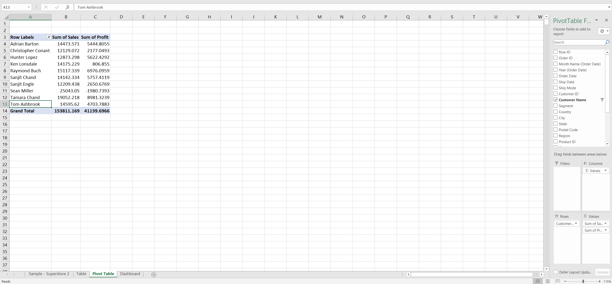
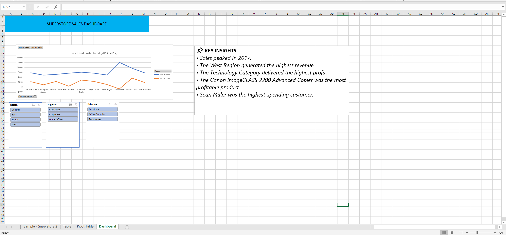

# 📊 Superstore Sales Analysis using Microsoft Excel

## 📌 Project Overview
This project presents a comprehensive sales and profit analysis of a retail superstore using Microsoft Excel. It demonstrates key data analysis, visualization, and dashboard creation skills essential for aspiring Data Analysts. The analysis uncovers actionable business insights to support data-driven decision-making.

---

## 🎯 Objectives
- Analyze sales and profit trends over time.
- Identify top-performing regions, categories, and products.
- Determine the highest-spending customers.
- Develop an interactive dashboard using Excel.
- Present key insights through visual storytelling.

---

## 🛠️ Tools & Techniques Used
- **Microsoft Excel**
- Pivot Tables
- Pivot Charts
- Interactive Dashboards
- Slicers and Filters
- Data Cleaning and Transformation
- Trend Analysis
- Business Insights Generation

---

## 📂 Dataset
- **Name:** Sample Superstore Dataset
- **Source:** Tableau Public
- **Type:** Retail transactional data
- **Purpose:** Educational and portfolio use

---

## 📈 Key Insights
- 📅 **Sales peaked in 2017.**
- 🌎 **The West Region generated the highest revenue.**
- 💻 **The Technology category delivered the highest profit.**
- 🖨️ **The Canon imageCLASS 2200 Advanced Copier was the most profitable product.**
- 👤 **Sean Miller was the highest-spending customer.**

---

## 📸 Project Screenshots

### 📊 Pivot Table – Sales and Profit by Customer

### 📈 Superstore Sales Dashboard

---

## 📁 Repository Structure

superstore-sales-analysis-excel/
│
├── Superstore-Sales-Analysis.xlsx
├── README.md
└── screenshots/
├── pivot-table-customer-sales-profit.png
└── superstore-sales-dashboard.png

---

## 🚀 How to Use This Project
1. Download the Excel file from this repository.
2. Open it using **Microsoft Excel (2016 or later recommended)**.
3. Navigate through the sheets:
   - **Sample - Superstore 2** – Raw dataset
   - **Pivot Table** – Analytical summaries
   - **Dashboard** – Interactive visual insights
4. Use slicers to filter data by **Region, Segment, and Category**.

---

## 💼 Skills Demonstrated
- Data Analysis
- Data Visualization
- Dashboard Development
- Business Intelligence
- Data Cleaning and Transformation
- Analytical Thinking
- Microsoft Excel

---

## 👨‍💻 Author
**Vinay N.**  
🎓 B.E. Computer Science Engineering, Easwari Engineering College  
📊 Aspiring Data Analyst  

🔗 **LinkedIn:** https://www.linkedin.com/in/vinay-n-48a25141/  
🔗 **GitHub:** https://github.com/vinay-2004-coder

---

## ⭐ Support
If you found this project useful, please consider giving it a ⭐ on GitHub!

---

## 📜 License
This project is intended for educational and portfolio purposes only.
